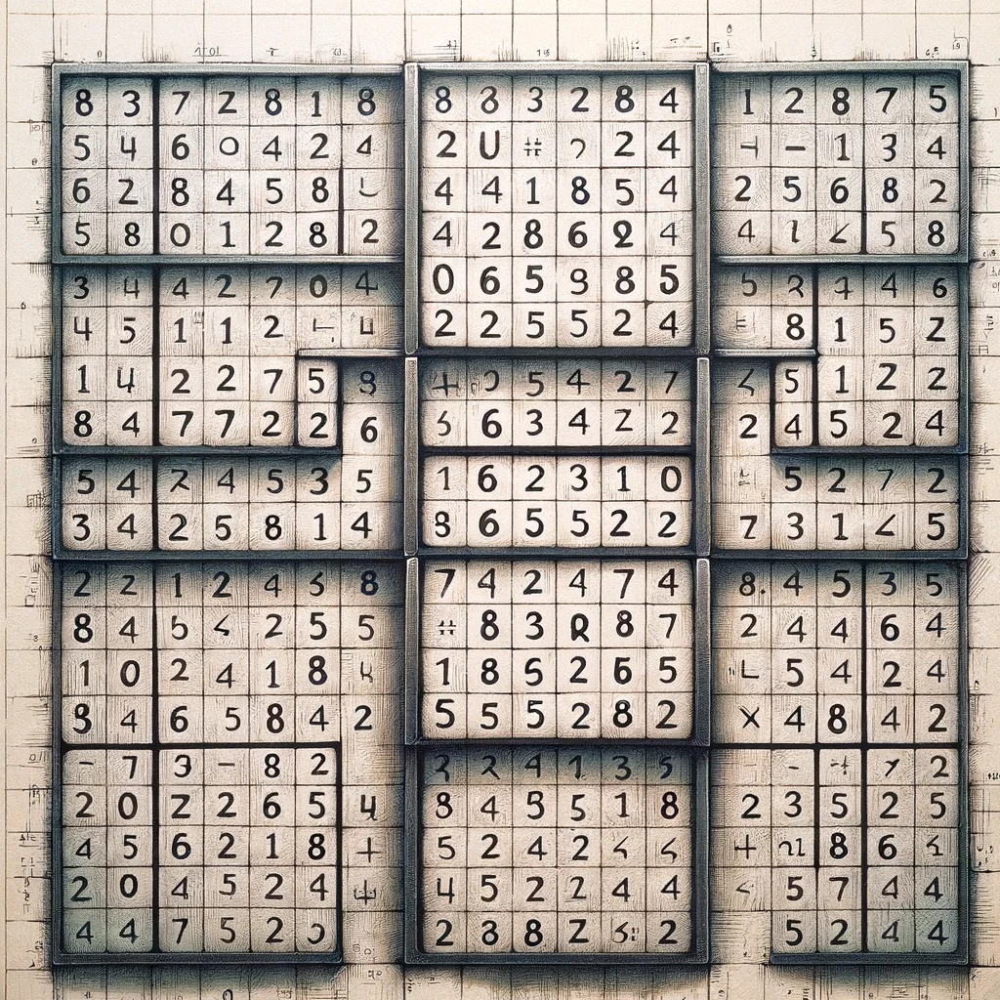

<h1 style="text-align: center;">[INF1007] | Projet 2 - Sudoku</h1>

 <i>Crédits: <a href="https://openai.com/blog/dall-e/">DALLE 3</a></i>

## Table des matières

- [1. Introduction](#1-introduction)
- [2. Objectifs](#2-objectifs)
- [3. Modules](#3-modules)
- [4. Le jeu](#4-le-jeu)
  - [4.1. Génération du jeu](#41-génération-du-jeu)
  - [4.2. Tests unitaires](#42-tests-unitaires)
  - [4.3. L'interface graphique](#43-linterface-graphique)
  - [4.4. Journalisation](#44-journalisation)
  - [4.5. Métriques de journalisation](#45-métriques-de-journalisation)
- [5. Remise](#5-remise)
- [6. Barème](#6-barème)

## ⏰ Date de remise : le dimanche 21 avril 23h59.

## 1. Introduction

- Le [**Sudoku**](https://fr.wikipedia.org/wiki/Sudoku) est un puzzle logique basé sur une grille de 9x9, avec l'objectif de remplir chaque ligne, colonne et sous-grille 3x3 avec les chiffres de 1 à 9 sans répétitions. 

- La création de votre jeu Sudoku impliquera l'utilisation de la programmation orientée objet pour structurer le jeu, l'interface graphique via [**pygame**](https://www.pygame.org/docs/) pour l'interaction utilisateur et le module [**logging**](https://docs.python.org/3/library/logging.html) pour la journalisation des événements et des erreurs. Enfin, toute partie reliée à la logique propre du jeu (et non de l'interface usager) devra être testée à l'aide de [**unittest**](https://docs.python.org/3/library/unittest.html).

- Aussi, l'analyse des métriques de journalisation avec [**seaborn**](https://seaborn.pydata.org) permet de visualiser des métriques telles que la sévérité des événements au fil du temps, et ce, à partir des données récoltées de journalisation, offrant une approche intégrée pour le développement, le suivi et l'optimisation du jeu.

## 2. Objectifs

- Intégrer les concepts de programmation orientée objet en vue de l'avènement d'une partie Sudoku complète.

- Apprendre à s'auto-documenter; à développer son autonomie en cherchant à travers la documentation pour mener à bien son projet.

- Apprendre à critiquer son propre code, à l'aide de tests unitaires qui valident la logique du jeu.

- Intégrer les concepts de journalisation au niveau de l'exécution de l'application entière, et ce, à travers le temps et selon divers niveaux de sévérité.

- Apprendre à produire une visualisation des métriques de journalisation récoltées (des sévérités) à travers le temps.

- Livrer un produit clef en main.

## 3. Modules

- Nous n'imposons **aucune restriction** quant aux modules (librairies) ajoutés à votre projet.

- Les librairies par défaut que vous devriez faire usage sont : [**pygame**](https://www.pygame.org/docs/), [**unittest**](https://docs.python.org/3/library/unittest.html), [**seaborn**](https://seaborn.pydata.org/) et [**logging**](https://docs.python.org/3/library/logging.html).

- Si vous souhaitez ajouter une autre librairie non native à Python, veuillez le préciser ici :

| Librairie(s) additionnelle(s)        |
| ------------------------------------ |
| **<...>**              |

## 4. Le jeu

- Au sein du squelette, nous vous fournissons d'emblée certaines classes pour faire office de présentation et pour orienter essentiellement votre programmation. Toutefois, **ces classes ne sont pas exhaustives**.

- Ne vous privez donc pas d'ajouter des classes, des interfaces, des méthodes, des constantes, des attributs et des variables pour augmenter la lisibilité et la maintenabilité de votre code. Un rappel préemptif : vous allez devoir tester votre logique ; quoi de mieux qu'un code modulaire ! Si vous sentez le besoin de découpler votre logique, nous vous recommandons fortement de créer davantage d'interfaces (classes) !

### 4.1. Génération du jeu

> **Fichiers d'intérêt :** **`sudoku.py`** qui intéragit avec la vue **`ui.py`**. D'autres interfaces et classes peuvent être bien entendu introduites.

#### Vous devez respecter les requis suivants :

**4.1.1.** Générer un plateau de jeu Sudoku vide.
- **4.1.1.1.** Il n'y a pas de restriction au niveau des constantes initiales injectées au sein du tableau dit *vide* de contenu.

- **4.1.1.2.** Une seule instance du plateau devrait être référée en tout temps à travers votre implémentation (Singleton).

**4.1.2.** Implémenter un algorithme de complétion automatique dudit plateau, en partant d'un tableau vide ou prérempli). Untel algorithme devrait être développé en programmation dynamique (*backtracking*). Vous pouvez vous référer aux tutoriels suivants (n'oubliez pas de citer vos références au sein de votre code !) :

- [Algorithm to Solve Sudoku | Sudoku Solver](https://www.geeksforgeeks.org/sudoku-backtracking-7/)
- [Sudoku-Backtracking algorithm and visualization](https://medium.com/analytics-vidhya/sudoku-backtracking-algorithm-and-visualization-75adec8e860c)
- [Use Backtracking Algorithm to Solve Sudoku](https://dev.to/christinamcmahon/use-backtracking-algorithm-to-solve-sudoku-270)
- [How to solve sudoku puzzles using backtracking algorithms and TypeScript](https://medium.com/@sulistef/how-to-solve-sudoku-puzzles-using-backtracking-algorithms-and-typescript-a3d7516c48ca)
- [Sudoku Solving algorithms](https://www.tutorialspoint.com/data_structures_algorithms/sudoku_solving_algorithms.htm)
- [Cracking Sudoku — How to Explore Backtracking Algorithms With Python](https://itnext.io/cracking-sudoku-how-to-explore-backtracking-algorithms-with-python-63a67067045d)
- [Solving Sudoku Puzzle using Backtracking in Python | Daily Python #29](https://medium.com/daily-python/solving-sudoku-puzzle-using-backtracking-in-python-daily-python-29-99a825042e)
- [Sudoku Solver-Python using Backtracking](https://levelup.gitconnected.com/sudoku-solver-python-using-backtracking-1aff17a3340)
- [Sudoku Solver with Python : a methodical approach for algorithm optimization [part 1]](https://medium.com/@ev.zafeiratos/sudoku-solver-with-python-a-methodical-approach-for-algorithm-optimization-part-1-b2c99887167f)
- [Solve a Sudoku Puzzle Using Backtracking in Python](https://python.plainenglish.io/solve-a-sudoku-puzzle-using-backtracking-in-python-8e9eb58e57e6)

- **4.1.2.1.** L'algorithme doit être développé en programmation dynamique.

- **4.1.2.2.** L'algorithme développé doit être référencé adéquatement. Essayez de ne pas réinventer la roue en suivant l'un des tutoriels mentionnés ci-haut.

- **4.1.2.3.** La complexité algorithmique n'est pas restreinte au niveau spatial ni temporel. Néanmoins, le temps et la complexité de votre approche ne devraient pas impacter l'expérience utilisateur.

**4.1.3.** Générer un plateau de jeu Sudoku de départ pour l'utilisateur. 

- **4.1.3.1.** Le niveau de difficulté doit être intégré lors de la génération.

- **4.1.3.2.** Le niveau de difficulté doit contenir trois modes : `Facile`, `Intermédiaire` et `Avancé`.

- **4.1.3.3.** Le niveau de difficulté par défaut doit être `Facile`.

- **4.1.3.4.** Le changement du niveau de difficulté à travers l'interface utilisateur doit réinitialiser le jeu au complet et appliquer le niveau de difficulté sélectionné.

- **4.1.3.5.** Les niveaux de difficulté dictent le nombre de cases déjà remplies au moment de l'affichage du plateau Sudoku au départ. Pour le mode **`Avancé`**, seul le nombre minimal de cases préremplies sont affichées comme point de départ au joueur (**il ne devrait exister qu'une seule case [ou le nombre minimal de cases] à découvrir qui contient un seul `Indice` [ou le nombre minimal d'indices]**). Pour le mode **`Intermédiaire`**, quelques cases supplémentaires (**d'une (1) à cinq (5) excédentaires**) sont ajoutées en haut du mode `Avancé` pour aider le joueur à débuter la partie. Pour le mode **`Facile`**, **six (6) à dix (10) cases supplémentaires sont remplies d'emblée**. Pensez à introduire le module [**`random`**](https://docs.python.org/3/library/random.html) pour la sélection exacte du nombre de cases préremplies à afficher.

- **4.1.3.6.** Pour une case donnée, implémentez un algorithme de recherche d'**`Indices`**. Un **`Indice`** représente tout simplement **une possibilité valide parmi les valeurs que peut posséder une case du plateau de jeu**, selon l'état actuel dudit plateau. Lorsque l'utilisateur sélectionne une case vide du plateau au sein de la vue du jeu, et clique ensuite sur le bouton **`Indices`**, **toutes les indices sont affichées élégamment dans le terminal au niveau de la case sélectionnée sur le plateau du jeu.** 

> **Fonctionnalité bonie 1** : vous pouvez afficher tous les indices à même une case sélectionnée du plateau du jeu (**au sein de l'interface en plus du terminal**) à la suite d'un clic sur le bouton `Indices`.

### 4.2. Tests unitaires

> **Fichiers d'intérêt :** **`tests.py`** qui intéragit avec votre logique de jeu **`sudoku.py`**. D'autres interfaces et classes peuvent être bien entendu introduites.

#### Vous devez respecter les requis suivants :

- **4.2.1.** Toute fonctionnalité développée qui a trait à la logique de génération et de déroulement de partie doit être testée.

- **4.2.2.** Aucune méthode reliée à la vue de [**pygame**](https://www.pygame.org/docs/), ni de votre module de journalisation (*logging*), ni de votre visualisation des métriques à produire, ne doit être testée.

- **4.2.3.** La librairie à utiliser pour vos tests est [**unittest**](https://docs.python.org/3/library/unittest.html).

- **4.2.4.** Deux tests doivent être effectués par méthode cible : un premier test de cas d'utilisation *normal* et un second test de cas d'utilisation *limite*. Vous devez introduire ces deux tests **uniquement** pour toute méthode qui hérite de votre logique de jeu (**`sudoku.py`**).

### 4.3. L'interface graphique

> **Fichiers d'intérêt :** **`ui.py`** qui intéragit avec votre logique de jeu **`sudoku.py`**. D'autres interfaces et classes peuvent être bien entendu introduites.

#### Vous devez respecter les requis suivants :

- **4.3.1.** Implémenter le déroulement de partie à travers la visualisation graphique. Une **`Partie`** devrait être scindée en **`Tour`**. Au premier **`Tour`**, le plateau de jeu doit s'initialiser automatiquement avec une difficulté **`Facile`** lorsque le joueur quitte le menu principal vers la vue du jeu (à la suite du clic sur **`Play`**). Un **`Tour`** n'a pas de limite de temps. Lors d'un **`Tour`**, le joueur doit être capable de sélectionner n'importe quelle **case vide** du plateau de jeu. La sélection se fait avec une souris ou par pavé tactile, à la fois pour le déplacement et le clic vers la case d'intérêt. Une case déjà remplie ne doit pas pouvoir être sélectionnée. Une fois une case vide sélectionnée, ladite case doit arborer un style visuel qui permet de la différencier des autres cases vides. Lorsqu'une case devient sélectionnée, la sélection d'une autre case vide sur le plateau désélectionne l'antécédente.

- **4.3.2.** Lorsqu'un utilisateur a sélectionné une case du plateau du jeu, les touches **{0, 1, 2, ..., 9}** du **clavier** doivent être prises en compte. L'appui d'un de ces chiffres alors qu'une case est sélectionnée doit vérifier d'abord la validité du chiffre entré selon l'état actuel du plateau. Un **`Tour`** est complet lorsque le chiffre injecté au sein de la case est **valide**. Le chiffre est alors placé sur le plateau du jeu et un nouveau tour commence. Il sera impossible de sélectionner cette même case au prochain tour (étant maintenant remplie). Sinon, l'utilisateur épuise sa banque de **`Chances`** (une **`Chance`** par essai infructueux), définie préalablement à **3**, toutes difficultés confondues. Lorsque toutes les **`Chances`** de l'utilisateur sont utilisées (**le compteur atteint 0 à la suite d'un dernier placement invalide**), le jeu s'arrête. La mise à jour des **`Chances`** restantes à l'utilisateur est communiquée à travers le terminal (sauf pour le cas de la **Fonctionnalité bonie 2**, voir ci-bas). Il n'est alors possible que de réinitialiser la partie à travers le bouton **`Nouvelle partie`**. La réinitialisation de la partie réinitialise également la banque de **`Chances`** de l'utilisateur. Au niveau de l'affichage des **`Chances`**, tout comme les **`Indices`**, 

> **Fonctionnalité bonie 2** : vous pouvez afficher les chances restantes **au sein de l'interface graphique** au fur et à mesure du déroulement de partie. **Dans tous les cas, les chances doivent être communiquées au sein du terminal également**.

- **4.3.3.** Tout bouton de l'interface doit être accessible en tout temps, étant réactif aux événements.

- **4.3.4.** Le bouton **`Indices`** doit afficher les **`Indices`** **au sein du terminal** pour une case préalablement sélectionnée au sein du plateau de jeu. **La fonctionnalité bonie doit en plus couvrir l'affichage des indices au sein de l'interface graphique.**

- **4.3.5.** Les boutons de difficulté (respectivement **`Facile`**, **`Intermédiaire`**, **`Avancé`**) changent uniquement la difficulté de la **prochaine partie**. Nous ne voulons pas que le clic de ces boutons affecte la partie en cours.

- **4.3.6.** Le bouton **`Nouvelle partie`** doit réinitialiser l'entièreté du jeu au niveau de difficulté précédemment sélectionné (par défaut, **`Facile`**), de manière automatique (sans message supplémentaire, qu'à l'appui dudit bouton). Les **`Chances`** doivent également être réinitialisées.

- **4.3.7.** Lorsqu'un utilisateur épuise ces **3** **`Chances`** originelles, le jeu s'arrête. Lorsque le tableau est lui-même rempli intégralement, le jeu s'arrête. Dans ces deux cas spécifiques, le concept de **`Tour`** n'est plus. **Un message de fin** doit être indiqué, **au sein de l'interface graphique**. Si l'utilisateur remporte la partie, un message de victoire doit être affiché en palette de couleur verdâtre ou bleutée. Si l'utilisateur perd la partie (épuise toutes ses **`Chances`**), un message de défaite doit être affiché en palette de couleur rougeâtre. L'interface est alors en état d'attente; soit l'utilisateur quitte la partie (`X`, voir **4.3.8.**), soit la partie est réinitialisée.

- **4.3.8.** On doit pouvoir quitter l'interface graphique uniquement par le bouton d'onglet `X` fournit au sein du squelette d'origine. Il n'est pas à prévoir un bouton supplémentaire pour fermer ladite interface. Le déroulement d'une partie ne doit pas fermer prématurément l'interface graphique, ni même après la fin d'une partie.

### 4.4. Journalisation

> **Fichiers d'intérêt :** **`logger.py`** qui intéragit avec votre logique de jeu **`sudoku.py`** et votre vue **`ui.py`**. D'autres interfaces et classes peuvent être bien entendu introduites.

#### Vous devez respecter les requis suivants :

- **4.4.1.** Votre journalisation doit contenir au moins trois niveaux de sécurité : **informatif**, **débogage** et **critique**. Le niveau **informatif** représente toutes les actions de **l'utilisateur** en cours de partie (par exemple : clic sur le bouton **`Indices`**, **`Facile`**, **`Intermédiaire`**, **`Avancé`** ou **`Nouvelle partie`**; clic sur la case du jeu [à quelle position], les valeurs entrées [quelles valeurs et leur validité], de même que les **`Chances`** restantes). Le niveau **débogage** représente toutes les actions du **système**, par exemple : génération du plateau, des messages, etc. Le niveau **critique** représente toutes les actions du **système** qui **ne devraient pas** se dérouler au sein d'une partie (**cas limites**), par exemple : gestions d'erreurs au sein d'un bloc **except**, etc.

- **4.4.2.** Il est imposé **au moins 10** messages de journalisation, par catégorie, lors du déroulement d'une partie.

- **4.4.3.** Pour chaque journalisation, vous devez extraire le **temps relatif** (depuis le début de la partie - **temps 0**) jusqu'au moment de journalisation, de même que le niveau de **sévérité** et le **message** pour chaque journalisation. Le module [**`time`**](https://docs.python.org/3/library/time.html) peut être employé pour récupérer le temps.

- **4.4.4.** La journalisation débute au moment de générer le plateau d'un nouveau jeu. La journalisation se termine lorsqu'un jeu se termine également.

- **4.4.5.** La journalisation complète d'une partie (contenant l'entièreté de vos temps relatifs, sévérités et messages) doit être généré en format **textuel** (en format **`.log`**) à la fin d'un jeu, nommé **`Rapport de journalisation N`**, **`N`** étant un simple entier qui permet de différencier les rapports de journalisation générés. Ce même format sera utilisé pour générer votre graphique de **sévérité** à travers le **temps** pour un jeu donné.

- **4.4.6.** Tous vos **`Rapports de journalisation`** doivent se trouver au sein d'un dossier **`logs`**. Une journalisation passée ne devrait jamais être altérée par une exécution *a posteriori*.

### 4.5. Métriques de journalisation

> **Fichiers d'intérêt :** **`metrics.py`** qui intéragit avec le dossier **`logs`**, produits de **`logger.py`**. D'autres interfaces et classes peuvent être bien entendu introduites.

#### Vous devez respecter les requis suivants :

- **4.5.1.** À partir d'un rapport de journalisation passé, il devra être possible d'y extraire l'ensemble des **sévérités** et des **estampilles de temps**.

- **4.5.2.** Le but est d'afficher un graphique des **sévérités à travers le temps**, à l'aide de [**seaborn**](https://seaborn.pydata.org).

- **4.5.3.** **Un** graphique parmi les choix suivants doit être généré : [**Lineplot**](https://seaborn.pydata.org/generated/seaborn.lineplot.html), [**Scatterplot**](https://seaborn.pydata.org/generated/seaborn.scatterplot.html), [**Barplot**](https://seaborn.pydata.org/generated/seaborn.barplot.html), [**Boxplot**](https://seaborn.pydata.org/generated/seaborn.boxplot.html), [**Violinplot**](https://seaborn.pydata.org/generated/seaborn.violinplot.html), [**Pointplot**](https://seaborn.pydata.org/generated/seaborn.pointplot.html), [**Kdeplot**](https://seaborn.pydata.org/generated/seaborn.kdeplot.html), voire [**Heatmap**](https://seaborn.pydata.org/generated/seaborn.heatmap.html).

## 5. Remise

- Votre solution complète pour ce projet doit être remise sur **GitHub**, au sein de votre répertoire respectif.

- La charge de travail de ce projet est tout de même considérable. La collaboration est permise et fortement conseillée, malgré que vos implémentations doivent être faites en silo, fruits de **votre** travail.

- ⏰ La date de remise est **le dimanche 21 avril 23h59**.

## 6. Barème

- L'évaluation de ce projet est basé sur 5 critères, soient la **génération du jeu**, les **tests unitaires**, l'**interface graphique**, la **journalisation** et l'affichage des métriques de sévérité de journalisation au fil du temps à l'aide d'un **graphique**.

- Pour chacune de ces fonctionnalités, une note d'exhaustivité et d'accomplissement sur **10** sera donnée pour moduler les pondérations. 

- Par exemple, la **Génération du jeu** vaut **6** points sur 20. Votre remise finale respecte la moitié des requis. Ainsi, votre facteur de modulation est de **0,5** (**5**/10), vous donnant la note finale de **3** points sur 20 pour cette fonctionnalité.

- Les fonctionnalités bonies réussies et complètes valent chacune un surplus de **10 %** à votre note (**2 points** sur 20), avec le même facteur de modulation associé aux fonctionnalités (sur **10**). Les points en surplus ne peuvent pas être appliqués à un travail pratique ou projet antécédents. 

| Fonctionnalités       | Points |
| --------------------- | ------ |
| Génération du jeu     | 6      |
| Tests unitaires       | 4      |
| Interface graphique   | 5      |
| Journalisation        | 3      |
| Graphique             | 2      |
| **Total**             | **20** |
